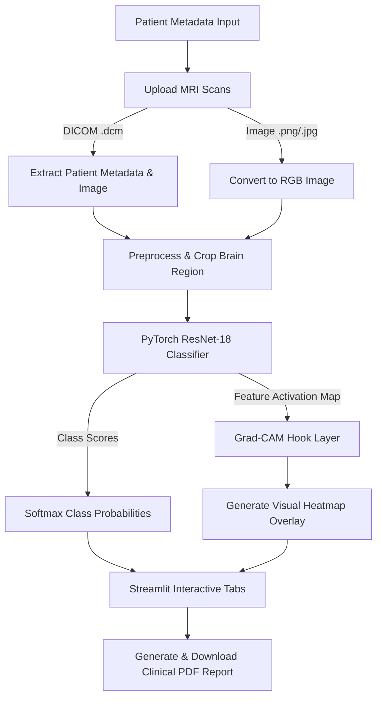

# 🧠 Brain MRI Tumor Detection & Analysis System

[](https://mriscan-ivzvvr7gbsmy3qsqs9nrff.streamlit.app/)
[](https://pytorch.org/)
[](https://www.python.org/)
[](https://opensource.org/licenses/MIT)

An end-to-end medical image diagnostic web application that utilizes a deep learning **ResNet-18** model to classify brain MRI scans for tumors. The system integrates **Grad-CAM** (Gradient-weighted Class Activation Mapping) to highlight anomalous regions, providing medical professionals with explainable visual evidence alongside quantitative probability metrics.

🔗 **Live Demo:** [MRI Scan Streamlit Dashboard](https://mriscan-ivzvvr7gbsmy3qsqs9nrff.streamlit.app/)

---

## 📸 System Workflow



---

## ✨ Features

*   **🏥 Patient Information Management**: Pre-populate patient metadata via a sidebar form or dynamically extract it from loaded files.
*   **📂 Multi-Format File Support**: Upload standard medical DICOM images (`.dcm`) as well as common web formats (`.jpg`, `.jpeg`, `.png`).
*   **🖼️ Smart Preprocessing**: Automatically crops images to focus on the brain area using OpenCV contouring and thresholding.
*   **🧠 Deep Learning Diagnosis**: Classifies slices with high accuracy into **Tumor** or **No Tumor** using a custom-trained ResNet-18 model.
*   **🔍 Explainable AI (Grad-CAM)**: Captures gradients at the last convolutional layer (`layer4[1].conv2`) to output visual explanation overlays (heatmaps) highlighting tumor locations.
*   **📊 Diagnostics Visualization**: Generates tumor probability charts and displays data tables comparing multiple MRI slices.
*   **📄 Clinical Report Generation**: Dynamically compiles patient details, classification results, and original/Grad-CAM images into a downloadable PDF document.

---

## 🛠️ Tech Stack & Libraries

*   **UI/Frontend**: [Streamlit](https://streamlit.io/)
*   **Machine Learning**: [PyTorch](https://pytorch.org/), [Torchvision](https://pytorch.org/vision/stable/index.html), [Scikit-learn](https://scikit-learn.org/)
*   **Computer Vision & Image Processing**: [OpenCV-Python-Headless](https://opencv.org/), [Pillow (PIL)](https://pillow.readthedocs.io/), [Matplotlib](https://matplotlib.org/)
*   **Medical Imaging**: [PyDICOM](https://pydicom.github.io/)
*   **PDF Compilation**: [FPDF](http://www.fpdf.org/)
*   **Data Analysis**: [Pandas](https://pandas.pydata.org/), [NumPy](https://numpy.org/)

---

## 📁 Repository Structure

```text
├── brain_tumor_dataset/     # Dataset divided into "yes" and "no" directories
│   ├── no/                  # MRI scans without tumors
│   └── yes/                 # MRI scans with tumors
├── app.py                   # Streamlit web dashboard and application logic
├── main.py                  # Model training and validation script (PyTorch)
├── requirements.txt         # Project package dependencies
├── resnet_mri.pth           # Trained ResNet-18 model weights (approx. 44.8 MB)
└── README.md                # Project documentation (this file)
```

---

## 🚀 Setup & Local Execution

Follow these steps to run the application on your local machine:

### 1. Prerequisites
Ensure you have **Python 3.8** or newer installed.

### 2. Clone the Repository
```bash
git clone https://github.com/ltsam26/MRI_SCAN.git
cd MRI_SCAN
```

### 3. Create a Virtual Environment & Install Dependencies
```bash
# Create environment
python -m venv venv

# Activate environment
# On Windows (Command Prompt)
venv\Scripts\activate
# On macOS/Linux
source venv/bin/activate

# Install required packages
pip install -r requirements.txt
```

### 4. Train the Model (Optional)
If you wish to re-train or train the model from scratch using the images inside `brain_tumor_dataset/`:
```bash
python main.py
```
This script will split the dataset into an 80/20 train/test split, train for 5 epochs using the Adam optimizer, print the model accuracy & classification report, and save the weights as `resnet_mri.pth`.

### 5. Launch the Dashboard
Start the Streamlit application:
```bash
streamlit run app.py
```
The app will open automatically in your default browser at `http://localhost:8501`.

---

## 💡 How to Use the App

1.  **Enter Patient Info**: Fill out the fields (Name, Age, Gender, Study Date) in the left sidebar and click **Save Info**.
2.  **Upload Scan(s)**: Drag & drop or browse for files (`.dcm`, `.png`, `.jpg`, or `.jpeg`). You can select multiple slices at once.
3.  **Inspect Results**:
    *   **Patient Info**: Displays the patient record card.
    *   **MRI & Grad-CAM**: View original scans side-by-side with heatmaps that identify the areas of concern.
    *   **Probability**: Tabular probability list and a horizontal bar chart displaying confidence levels.
    *   **Report PDF**: Generate and download a comprehensive clinical report locally as a PDF.

---

## ⚖️ Disclaimer
*This system is intended for educational and research purposes only. It is not approved for clinical diagnostics or medical decision-making. Always consult a certified medical professional for official clinical assessments.*
